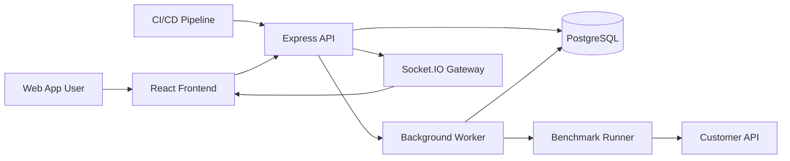

# Regressor99 Architecture

Regressor99 is a production-grade SaaS platform for continuous API performance regression detection. The architecture should make it easy to add features incrementally without turning the codebase into a pile of route handlers, raw queries, and one-off scripts.

The first principle is separation of responsibility:

- The frontend helps users understand projects, deployments, benchmark history, regressions, and performance budgets.
- The API owns authentication, authorization, organization boundaries, business rules, and orchestration.
- The database is the source of truth for tenants, projects, benchmark configuration, run results, baselines, regressions, budgets, and audit history.
- Background workers execute long-running benchmark and analysis jobs outside request/response paths.
- CI/CD integrations submit deployments and trigger benchmark runs through stable API contracts.

## Product Boundaries

Regressor99 is not a generic load-testing replacement. It is a regression intelligence system.

The core product answers these questions:

- Did this deployment make an API slower?
- Which endpoint, metric, suite, or budget changed?
- How bad is the change compared with the baseline?
- Is the deployment allowed to continue?
- What historical evidence supports the decision?

The MVP should focus on reliable data modeling, clean tenant isolation, benchmark run ingestion, baseline comparison, regression records, and budget evaluation before adding AI or advanced dashboards.

## High-Level System



## Application Architecture

Use a modular monolith first. This is the right starting point because the product has many related domain concepts, but we do not yet need the operational complexity of microservices.

Each backend feature should be organized by domain module:

- `auth`
- `users`
- `organizations`
- `memberships`
- `projects`
- `deployments`
- `benchmark-suites`
- `benchmark-runs`
- `metrics`
- `baselines`
- `regressions`
- `performance-budgets`
- `activity-logs`
- `webhooks`
- `notifications`

Each module should generally contain:

- `routes`: Express route definitions.
- `controller`: HTTP-specific request/response handling.
- `service`: business logic and orchestration.
- `repository`: database access through Prisma.
- `schema`: validation schemas.
- `types`: module-specific TypeScript types.
- `tests`: focused unit and integration tests.

Controllers should stay thin. Services should own decisions. Repositories should own persistence. This keeps future feature work predictable.

## Repository Structure

Target structure:

```text
api-regressor99/
  apps/
    api/
      src/
        app.ts
        server.ts
        config/
        db/
        middleware/
        modules/
        jobs/
        realtime/
        shared/
        tests/
      prisma/
        schema.prisma
        migrations/
      Dockerfile
      package.json
      tsconfig.json
    web/
      src/
        app/
        components/
        features/
        hooks/
        lib/
        routes/
        stores/
        styles/
      package.json
      vite.config.ts
      tsconfig.json
  packages/
    shared/
      src/
        contracts/
        types/
        constants/
  docs/
    ARCHITECTURE.md
    DATABASE.md
    API.md
    DEVELOPMENT.md
  docker-compose.yml
  package.json
  README.md
```

Why a monorepo:

- The frontend and backend can share typed contracts.
- API changes and UI changes can land in one pull request.
- Docker and local development stay simpler.
- Later extraction into services remains possible if a module becomes independently scalable.

## Backend Request Flow

Typical request path:

```text
HTTP request
  -> Express route
  -> authentication middleware
  -> authorization middleware
  -> validation schema
  -> controller
  -> service
  -> repository
  -> Prisma
  -> PostgreSQL
```

Rules:

- Validate every request body, query string, and route parameter.
- Never trust `organizationId` from the client without checking membership.
- Keep tenant-scoped queries explicit.
- Return stable error shapes.
- Use transactions for multi-write business operations.
- Write activity logs for significant changes.

## Database Architecture

PostgreSQL is a core part of the product, not just storage. Performance history, comparisons, baselines, and budget evaluation are data-heavy workflows, so the schema must be designed deliberately.

Core entities:

- `users`
- `organizations`
- `organization_members`
- `projects`
- `project_members`
- `deployments`
- `benchmark_suites`
- `benchmark_suite_versions`
- `benchmark_endpoints`
- `benchmark_runs`
- `benchmark_run_metrics`
- `baselines`
- `regressions`
- `performance_budgets`
- `budget_evaluations`
- `activity_logs`
- `api_keys`
- `refresh_tokens`

Important PostgreSQL patterns:

- Foreign keys for correctness across tenant-owned data.
- Composite indexes for common tenant-scoped queries.
- JSONB for flexible deployment metadata, request headers, payloads, and runner configuration.
- Materialized views later for expensive dashboard summaries.
- Window functions for historical ranking, rolling averages, and trend comparisons.
- Partitioning later for very large benchmark metric tables.
- Transactions for creating runs, inserting metrics, evaluating budgets, and creating regression records atomically.
- LISTEN/NOTIFY can be introduced later for lightweight realtime events, but Socket.IO plus explicit event publishing is simpler for MVP.

Initial indexing strategy:

- `organization_members(user_id, organization_id)`
- `projects(organization_id, created_at)`
- `deployments(project_id, deployed_at)`
- `benchmark_suites(project_id, created_at)`
- `benchmark_runs(suite_id, started_at)`
- `benchmark_runs(project_id, status, started_at)`
- `benchmark_run_metrics(run_id, endpoint_id)`
- `baselines(suite_id, is_active)`
- `regressions(project_id, created_at)`
- `performance_budgets(project_id, enabled)`

Indexing rule: every list page and every authorization lookup should have an intentional index.

## Tenancy And Authorization

Regressor99 should use organization-based tenancy.

Roles:

- `OWNER`: full organization control, billing later, member management.
- `ADMIN`: manage projects, suites, budgets, deployments, and members except owners.
- `DEVELOPER`: create runs, manage suites, view regressions, acknowledge assigned issues.
- `VIEWER`: read-only access.

Authorization should be centralized through policy helpers, not scattered `if` statements in controllers.

Example policy style:

```ts
canManageProject(actor, organizationId)
canCreateBenchmarkRun(actor, projectId)
canViewRegression(actor, regressionId)
```

Every domain service should receive the actor context and enforce permissions before performing business operations.

## API Design

Use REST for MVP. It is simple, easy for CI/CD integrations, and fits the platform well.

Base shape:

```text
/api/v1/auth
/api/v1/organizations
/api/v1/organizations/:organizationId/members
/api/v1/projects
/api/v1/projects/:projectId/deployments
/api/v1/projects/:projectId/benchmark-suites
/api/v1/benchmark-suites/:suiteId/runs
/api/v1/benchmark-runs/:runId/metrics
/api/v1/projects/:projectId/regressions
/api/v1/projects/:projectId/performance-budgets
/api/v1/webhooks
```

Response conventions:

```json
{
  "data": {},
  "meta": {},
  "error": null
}
```

Error conventions:

```json
{
  "data": null,
  "meta": {},
  "error": {
    "code": "PROJECT_NOT_FOUND",
    "message": "Project not found.",
    "details": {}
  }
}
```

Use cursor pagination for event-heavy resources such as runs, regressions, deployments, and activity logs.

## Benchmark Execution Model

Benchmark execution should not run inside normal HTTP requests.

MVP flow:

1. User or CI/CD creates a benchmark run.
2. API records the run as `QUEUED`.
3. Worker picks up the run.
4. Worker executes the benchmark suite against the target API.
5. Worker stores metrics.
6. Worker compares against active baseline.
7. Worker evaluates performance budgets.
8. Worker creates regression records if needed.
9. Worker marks the run as `COMPLETED`, `FAILED`, or `CANCELLED`.
10. API emits realtime updates to the frontend.

For the MVP, a simple database-backed job table is acceptable. Later we can introduce BullMQ with Redis if concurrency, retries, and scheduling become more complex.

## Regression Detection Strategy

Start with deterministic rules before advanced statistics.

Initial comparison:

- Compare current run metrics against the active baseline.
- Calculate percentage change for p50, p95, p99, average latency, error rate, and throughput.
- Classify severity as `LOW`, `MEDIUM`, `HIGH`, or `CRITICAL`.
- Create regression records only when thresholds are exceeded.

Later improvements:

- Rolling baselines.
- Confidence scoring.
- Outlier detection.
- Environment-aware comparisons.
- Endpoint-level trend analysis.
- Statistical significance checks.

Do not add AI explanations until deterministic regression detection is trustworthy.

## Frontend Architecture

The frontend should be feature-based, not only component-based.

Target structure:

```text
apps/web/src/
  app/
  routes/
  features/
    auth/
    organizations/
    projects/
    deployments/
    benchmark-suites/
    benchmark-runs/
    regressions/
    performance-budgets/
    dashboard/
  components/
    ui/
    layout/
    charts/
  hooks/
  lib/
  stores/
  styles/
```

Use:

- TanStack Query for server state.
- Zustand for small client-only UI state.
- Typed API client functions.
- Feature folders for screens, queries, mutations, and local components.
- Shared UI components for buttons, tables, dialogs, forms, empty states, and charts.

The product UI should feel operational and dense: dashboards, tables, filters, trend charts, run detail pages, and regression review flows matter more than marketing-style layouts.

## Realtime Architecture

Use Socket.IO for run progress and dashboard updates.

Initial events:

- `benchmark_run.queued`
- `benchmark_run.started`
- `benchmark_run.metric_received`
- `benchmark_run.completed`
- `benchmark_run.failed`
- `regression.detected`
- `budget_evaluation.completed`

Realtime events should never be the only source of truth. The frontend should always refetch the canonical resource after receiving an event.

## Security Architecture

MVP requirements:

- Passwords hashed with a strong password hashing algorithm.
- Short-lived access tokens.
- Refresh tokens stored server-side and rotated.
- API keys for CI/CD integrations.
- Role-based access control.
- Organization-scoped authorization.
- Strict CORS configuration.
- Rate limiting on auth and webhook endpoints.
- Request validation everywhere.
- Audit logs for important actions.
- Environment variables validated at startup.

Secrets must never be stored in source control. Local `.env.example` files should document required variables without real values.

## Testing Strategy

Testing should match risk.

Backend:

- Unit tests for services and policy helpers.
- Integration tests for routes and database behavior.
- Repository tests where query correctness matters.
- Regression detection tests with realistic metric examples.
- Budget evaluation tests for pass, warn, and fail outcomes.

Frontend:

- Component tests for complex forms and tables.
- Integration tests for feature flows.
- Visual/manual checks for dashboard and responsive layout.

End-to-end:

- Authentication flow.
- Create organization and project.
- Create suite.
- Trigger run.
- Store metrics.
- Detect regression.
- Evaluate budget.

## Development Workflow

Every feature should follow the same sequence:

1. Define requirements.
2. Define domain model changes.
3. Define database schema and indexes.
4. Define API contract.
5. Define authorization rules.
6. Define folder/module changes.
7. Implement backend.
8. Add focused tests.
9. Implement frontend.
10. Verify locally.
11. Update docs.
12. Commit with a professional message.

Feature branches should use the `codex/` prefix unless we intentionally choose another convention.

Suggested commit style:

```text
feat(auth): add refresh token rotation
fix(runs): prevent cross-organization run access
docs(architecture): define backend module boundaries
test(regressions): cover p95 severity classification
```

## MVP Roadmap

Phase 1: Foundation

- Monorepo setup.
- Backend API scaffold.
- Frontend scaffold.
- Docker Compose with PostgreSQL.
- Prisma setup.
- Environment validation.
- Health check endpoint.

Phase 2: Identity And Tenancy

- Registration.
- Login.
- Refresh token rotation.
- Logout.
- Organizations.
- Memberships.
- RBAC policies.

Phase 3: Projects And Deployments

- Project CRUD.
- Deployment records.
- CI/CD API keys.
- Deployment webhook endpoint.

Phase 4: Benchmark Configuration

- Benchmark suites.
- Suite versioning.
- Endpoints, headers, payloads, and load profiles.
- Manual run creation.

Phase 5: Run Execution And Metrics

- Background worker.
- Run lifecycle.
- Metric storage.
- Run detail API.
- Basic realtime updates.

Phase 6: Baselines, Budgets, And Regressions

- Active baselines.
- Historical baseline records.
- Budget rules.
- Budget evaluations.
- Regression detection.
- Regression acknowledgment flow.

Phase 7: Dashboard And Trends

- Project dashboard.
- Run history.
- Regression list.
- Budget status.
- Latency and throughput charts.

Phase 8: Production Readiness

- Logging.
- Error monitoring.
- Rate limits.
- Docker hardening.
- Railway deployment.
- Neon PostgreSQL setup.
- Netlify or Vercel deployment.

## Architectural Decisions

### Modular monolith first

This avoids premature distributed systems complexity while still keeping boundaries clear. If benchmark execution or realtime processing needs separate scaling later, those modules can be extracted.

### PostgreSQL as the analytical backbone

The product depends on historical comparisons, aggregations, and time-based queries. PostgreSQL gives us relational correctness plus advanced analytical features without needing a separate analytics database early.

### REST before GraphQL

CI/CD systems and webhooks are easier to integrate with REST. The frontend can still stay typed through shared contracts and API client functions.

### Background worker before external queue

A database-backed job model is easier to reason about in the MVP. Redis and BullMQ become worthwhile when we need higher throughput, delayed jobs, backoff policies, or distributed worker coordination.

### Deterministic regression rules before AI

Regression detection must be explainable. AI can later summarize or suggest causes, but it should not be the first source of truth.

## Definition Of Done

A feature is not done until:

- The domain behavior is implemented.
- Authorization is enforced.
- Inputs are validated.
- Database changes include indexes where needed.
- Tests cover important success and failure paths.
- Errors are stable and understandable.
- Activity logging is considered.
- Docs are updated when contracts or architecture change.
- The feature can be run locally.

