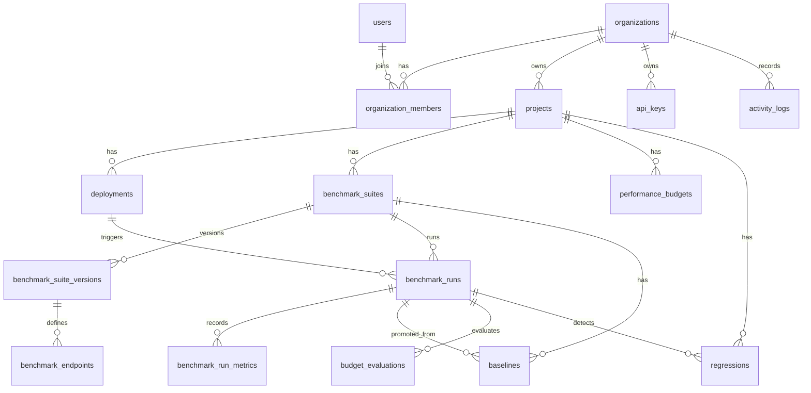

# Regressor99 Database Design

This document defines the initial PostgreSQL data model for Regressor99. It should guide the first Prisma schema and migrations.

The database must support multi-tenant SaaS behavior, benchmark run history, baseline comparison, budget evaluation, regression tracking, and auditability.

## Database Principles

- PostgreSQL is the source of truth.
- Every tenant-owned table should be reachable from `organizations`.
- Foreign keys should protect important relationships.
- Indexes should be designed for real access patterns.
- JSONB should be used for flexible metadata, not as a replacement for core relational fields.
- Historical records should not be overwritten when auditability matters.
- Benchmark run and metric data should be designed with future scale in mind.

## Naming Conventions

Database tables should use snake_case:

```text
benchmark_runs
performance_budgets
activity_logs
```

Prisma models can use PascalCase:

```text
BenchmarkRun
PerformanceBudget
ActivityLog
```

Enum values should use uppercase snake case:

```text
NEEDS_REVIEW
ERROR_RATE
CRITICAL
```

## Entity Relationship Overview



## Core Tables

### users

Stores user accounts.

Important fields:

- `id`
- `email`
- `name`
- `password_hash`
- `created_at`
- `updated_at`

Constraints:

- Unique `email`.

Indexes:

- `users(email)`

### organizations

Top-level tenant table.

Important fields:

- `id`
- `name`
- `slug`
- `created_at`
- `updated_at`

Constraints:

- Unique `slug`.

Indexes:

- `organizations(slug)`

### organization_members

Connects users to organizations with roles.

Important fields:

- `id`
- `organization_id`
- `user_id`
- `role`
- `created_at`
- `updated_at`

Constraints:

- Unique `(organization_id, user_id)`.
- Foreign key to `organizations`.
- Foreign key to `users`.

Indexes:

- `organization_members(user_id, organization_id)`
- `organization_members(organization_id, role)`

Why:

- User session needs fast organization lookup.
- Authorization needs fast membership checks.

### refresh_tokens

Stores refresh token records for session rotation and revocation.

Important fields:

- `id`
- `user_id`
- `token_hash`
- `expires_at`
- `revoked_at`
- `replaced_by_token_id`
- `created_at`

Constraints:

- Foreign key to `users`.
- Unique `token_hash`.

Indexes:

- `refresh_tokens(user_id, expires_at)`
- `refresh_tokens(token_hash)`

Security note:

- Store token hashes, not raw refresh tokens.

## Project And Deployment Tables

### projects

Represents a deployable API service.

Important fields:

- `id`
- `organization_id`
- `name`
- `slug`
- `description`
- `default_base_url`
- `created_at`
- `updated_at`

Constraints:

- Foreign key to `organizations`.
- Unique `(organization_id, slug)`.

Indexes:

- `projects(organization_id, created_at)`
- `projects(organization_id, slug)`

### deployments

Represents a released version of a project.

Important fields:

- `id`
- `organization_id`
- `project_id`
- `environment`
- `commit_sha`
- `branch`
- `version`
- `deploy_reference`
- `deployed_at`
- `metadata`
- `created_at`

Constraints:

- Foreign key to `organizations`.
- Foreign key to `projects`.

Indexes:

- `deployments(project_id, deployed_at)`
- `deployments(project_id, environment, deployed_at)`
- `deployments(project_id, commit_sha)`

JSONB:

- `metadata` for provider-specific deployment information.

Why include `organization_id` if project already has it:

- It makes tenant-scoped queries and future partitioning easier.
- It requires care to avoid mismatch. The service layer must ensure the project belongs to the organization.

## Benchmark Suite Tables

### benchmark_suites

The editable logical benchmark suite.

Important fields:

- `id`
- `organization_id`
- `project_id`
- `name`
- `description`
- `target_base_url`
- `is_active`
- `created_at`
- `updated_at`

Constraints:

- Foreign key to `organizations`.
- Foreign key to `projects`.

Indexes:

- `benchmark_suites(project_id, created_at)`
- `benchmark_suites(project_id, is_active)`

### benchmark_suite_versions

Immutable versions of a benchmark suite.

Important fields:

- `id`
- `organization_id`
- `suite_id`
- `version_number`
- `load_profile`
- `config_hash`
- `created_by_user_id`
- `created_at`

Constraints:

- Foreign key to `organizations`.
- Foreign key to `benchmark_suites`.
- Foreign key to `users` for `created_by_user_id`.
- Unique `(suite_id, version_number)`.

Indexes:

- `benchmark_suite_versions(suite_id, version_number)`
- `benchmark_suite_versions(suite_id, created_at)`

JSONB:

- `load_profile` for virtual users, duration, ramp-up, request rate, and future runner-specific options.

Why version suites:

- A run must always be explainable against the exact suite definition used at the time.

### benchmark_endpoints

Endpoints included in a suite version.

Important fields:

- `id`
- `organization_id`
- `suite_version_id`
- `name`
- `method`
- `path`
- `headers`
- `query_params`
- `body`
- `expected_status`
- `assertions`
- `timeout_ms`
- `created_at`

Constraints:

- Foreign key to `organizations`.
- Foreign key to `benchmark_suite_versions`.

Indexes:

- `benchmark_endpoints(suite_version_id)`

JSONB:

- `headers`
- `query_params`
- `body`
- `assertions`

Why JSONB here:

- Request payloads and assertions are flexible.
- Core query patterns usually filter by suite version, not by individual JSON fields.

## Benchmark Run Tables

### benchmark_runs

One execution of a benchmark suite.

Important fields:

- `id`
- `organization_id`
- `project_id`
- `suite_id`
- `suite_version_id`
- `deployment_id`
- `triggered_by_user_id`
- `triggered_by_api_key_id`
- `trigger_source`
- `environment`
- `target_base_url`
- `execution_status`
- `decision_status`
- `started_at`
- `finished_at`
- `failure_reason`
- `metadata`
- `created_at`
- `updated_at`

Constraints:

- Foreign key to `organizations`.
- Foreign key to `projects`.
- Foreign key to `benchmark_suites`.
- Foreign key to `benchmark_suite_versions`.
- Optional foreign key to `deployments`.
- Optional foreign key to `users`.
- Optional foreign key to `api_keys`.

Indexes:

- `benchmark_runs(project_id, created_at)`
- `benchmark_runs(project_id, environment, created_at)`
- `benchmark_runs(suite_id, created_at)`
- `benchmark_runs(project_id, execution_status, created_at)`
- `benchmark_runs(project_id, decision_status, created_at)`
- `benchmark_runs(deployment_id)`

JSONB:

- `metadata` for runner-specific details, CI/CD payload, and debugging info.

### benchmark_run_metrics

Stores metrics produced by a completed run.

Important fields:

- `id`
- `organization_id`
- `run_id`
- `endpoint_id`
- `request_count`
- `success_count`
- `error_count`
- `average_latency_ms`
- `p50_latency_ms`
- `p95_latency_ms`
- `p99_latency_ms`
- `min_latency_ms`
- `max_latency_ms`
- `throughput_rps`
- `error_rate`
- `created_at`

Constraints:

- Foreign key to `organizations`.
- Foreign key to `benchmark_runs`.
- Optional foreign key to `benchmark_endpoints`.

Indexes:

- `benchmark_run_metrics(run_id)`
- `benchmark_run_metrics(run_id, endpoint_id)`
- `benchmark_run_metrics(endpoint_id, created_at)`

Future scale:

- This table can become large.
- Partitioning by time or organization may be introduced later.

## Baseline Tables

### baselines

Known-good performance references for suite comparisons.

Important fields:

- `id`
- `organization_id`
- `project_id`
- `suite_id`
- `suite_version_id`
- `source_run_id`
- `environment`
- `version_number`
- `is_active`
- `reason`
- `promoted_by_user_id`
- `active_from`
- `active_to`
- `created_at`

Constraints:

- Foreign key to `organizations`.
- Foreign key to `projects`.
- Foreign key to `benchmark_suites`.
- Foreign key to `benchmark_suite_versions`.
- Foreign key to `benchmark_runs`.
- Foreign key to `users`.

Indexes:

- `baselines(suite_id, environment, is_active)`
- `baselines(project_id, environment, created_at)`
- `baselines(source_run_id)`

Important rule:

- Only one active baseline should exist for a comparable scope.

PostgreSQL note:

- In raw PostgreSQL, this is best enforced with a partial unique index:

```sql
CREATE UNIQUE INDEX baselines_one_active_per_suite_env
ON baselines (suite_id, environment)
WHERE is_active = true;
```

Prisma support for partial indexes is limited, so this may need a raw SQL migration.

### baseline_metrics

Snapshot metrics for a baseline.

Important fields:

- `id`
- `organization_id`
- `baseline_id`
- `endpoint_id`
- `request_count`
- `average_latency_ms`
- `p50_latency_ms`
- `p95_latency_ms`
- `p99_latency_ms`
- `throughput_rps`
- `error_rate`
- `created_at`

Constraints:

- Foreign key to `organizations`.
- Foreign key to `baselines`.
- Optional foreign key to `benchmark_endpoints`.

Indexes:

- `baseline_metrics(baseline_id)`
- `baseline_metrics(baseline_id, endpoint_id)`

Why snapshot baseline metrics:

- It keeps comparison stable even if source run or metric storage evolves later.

## Budget And Regression Tables

### performance_budgets

Defines acceptable performance for a project, suite, or endpoint.

Important fields:

- `id`
- `organization_id`
- `project_id`
- `suite_id`
- `endpoint_id`
- `name`
- `metric`
- `operator`
- `warn_threshold`
- `fail_threshold`
- `unit`
- `is_hard`
- `is_enabled`
- `created_at`
- `updated_at`

Constraints:

- Foreign key to `organizations`.
- Foreign key to `projects`.
- Optional foreign key to `benchmark_suites`.
- Optional foreign key to `benchmark_endpoints`.

Indexes:

- `performance_budgets(project_id, is_enabled)`
- `performance_budgets(suite_id, is_enabled)`
- `performance_budgets(endpoint_id, is_enabled)`

### budget_evaluations

Stores the result of applying a budget to a run.

Important fields:

- `id`
- `organization_id`
- `run_id`
- `budget_id`
- `metric`
- `actual_value`
- `warn_threshold`
- `fail_threshold`
- `result`
- `created_at`

Constraints:

- Foreign key to `organizations`.
- Foreign key to `benchmark_runs`.
- Foreign key to `performance_budgets`.

Indexes:

- `budget_evaluations(run_id)`
- `budget_evaluations(budget_id, created_at)`
- `budget_evaluations(run_id, result)`

### regressions

Durable records of detected performance degradations.

Important fields:

- `id`
- `organization_id`
- `project_id`
- `run_id`
- `baseline_id`
- `endpoint_id`
- `deployment_id`
- `type`
- `metric`
- `baseline_value`
- `current_value`
- `change_percent`
- `severity`
- `status`
- `detected_at`
- `acknowledged_by_user_id`
- `acknowledged_at`
- `resolved_by_user_id`
- `resolved_at`
- `resolution_reason`
- `created_at`
- `updated_at`

Constraints:

- Foreign key to `organizations`.
- Foreign key to `projects`.
- Foreign key to `benchmark_runs`.
- Foreign key to `baselines`.
- Optional foreign key to `benchmark_endpoints`.
- Optional foreign key to `deployments`.
- Optional foreign keys to `users` for acknowledgement and resolution.

Indexes:

- `regressions(project_id, created_at)`
- `regressions(project_id, status, created_at)`
- `regressions(run_id)`
- `regressions(deployment_id)`
- `regressions(severity, created_at)`

## Exceptions And Audit Tables

### decision_exceptions

Stores approved exceptions for failed or risky deployment decisions.

Important fields:

- `id`
- `organization_id`
- `project_id`
- `run_id`
- `approved_by_user_id`
- `reason`
- `expires_at`
- `created_at`

Constraints:

- Foreign key to `organizations`.
- Foreign key to `projects`.
- Foreign key to `benchmark_runs`.
- Foreign key to `users`.

Indexes:

- `decision_exceptions(project_id, expires_at)`
- `decision_exceptions(run_id)`

### activity_logs

Audit trail for significant user and system actions.

Important fields:

- `id`
- `organization_id`
- `actor_user_id`
- `actor_api_key_id`
- `action`
- `entity_type`
- `entity_id`
- `metadata`
- `created_at`

Constraints:

- Foreign key to `organizations`.
- Optional foreign key to `users`.
- Optional foreign key to `api_keys`.

Indexes:

- `activity_logs(organization_id, created_at)`
- `activity_logs(entity_type, entity_id, created_at)`
- `activity_logs(actor_user_id, created_at)`

JSONB:

- `metadata` for action-specific details.

## API Key Tables

### api_keys

Credentials for CI/CD and external integrations.

Important fields:

- `id`
- `organization_id`
- `project_id`
- `name`
- `key_prefix`
- `key_hash`
- `scopes`
- `last_used_at`
- `revoked_at`
- `created_by_user_id`
- `created_at`

Constraints:

- Foreign key to `organizations`.
- Optional foreign key to `projects`.
- Foreign key to `users`.
- Unique `key_hash`.

Indexes:

- `api_keys(organization_id, project_id)`
- `api_keys(key_prefix)`
- `api_keys(key_hash)`

Security note:

- Store only a hash of the API key.
- Show the raw key once at creation time.

JSONB:

- `scopes` can start as JSONB, but may become a join table later if permission querying becomes complex.

## Enum Candidates

Initial enums:

```text
OrganizationRole:
  OWNER
  ADMIN
  DEVELOPER
  VIEWER

HttpMethod:
  GET
  POST
  PUT
  PATCH
  DELETE
  HEAD
  OPTIONS

TriggerSource:
  MANUAL
  API
  CI_CD
  WEBHOOK
  GITHUB_ACTIONS

ExecutionStatus:
  QUEUED
  RUNNING
  COMPLETED
  FAILED
  CANCELLED

DecisionStatus:
  PASSED
  WARNED
  FAILED
  NEEDS_REVIEW

BudgetMetric:
  AVERAGE_LATENCY
  P50_LATENCY
  P95_LATENCY
  P99_LATENCY
  ERROR_RATE
  THROUGHPUT

BudgetResult:
  PASS
  WARN
  FAIL

RegressionType:
  LATENCY
  ERROR_RATE
  THROUGHPUT

RegressionSeverity:
  LOW
  MEDIUM
  HIGH
  CRITICAL

RegressionStatus:
  OPEN
  ACKNOWLEDGED
  RESOLVED
  ACCEPTED
```

## Multi-Tenancy Rules

Rules:

- Every request must resolve the actor.
- Every tenant-owned query must include organization scope.
- Services must verify membership before accessing project data.
- API keys must be scoped to organization or project.
- Cross-organization access should be impossible through route parameters alone.

Implementation note:

- Even when a table has `project_id`, including `organization_id` helps keep tenant filtering explicit.
- Services should validate parent ownership when creating nested records.

## Transaction Rules

Use transactions for:

- User registration plus organization creation.
- Creating a benchmark suite version plus endpoints.
- Completing a benchmark run plus metrics plus budget evaluations plus regressions.
- Promoting a baseline and deactivating the previous active baseline.
- Approving exceptions plus activity log creation.

Why:

- These operations represent one business action.
- Partial writes would create confusing product state.

## JSONB Usage

Use JSONB for:

- Deployment metadata.
- Benchmark request headers.
- Query parameters.
- Request body.
- Assertions.
- Load profile.
- Runner metadata.
- Activity log metadata.

Avoid JSONB for:

- Core IDs.
- Statuses.
- Metrics we filter or sort by.
- Tenant ownership.
- Authorization data that must be queried often.

## Future PostgreSQL Features

### Partial Unique Indexes

Used for one active baseline per suite/environment.

### Window Functions

Useful later for:

- Rolling averages.
- Ranking slowest endpoints.
- Comparing current run against previous N runs.

### Materialized Views

Useful later for dashboard summaries.

Examples:

- Latest project health.
- Seven-day regression counts.
- Endpoint trend summaries.

### Partitioning

Useful later for large metric tables.

Likely candidates:

- `benchmark_run_metrics`
- future raw request samples table
- `activity_logs`

### LISTEN / NOTIFY

Possible later for lightweight event propagation. MVP can use explicit event publishing in application code.

